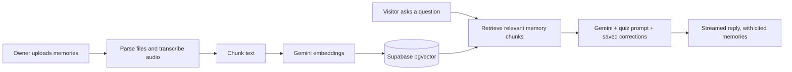

# MindClone

> A personal AI that talks like you, grounded in your own memories instead of generic answers.

**[Live demo](https://mindclone-tau.vercel.app)**

## What it does

MindClone lets anyone create an AI version of themselves. The owner answers a personality quiz, uploads their memories, and corrects the AI over time. Visitors then chat through a shareable link and receive responses grounded in the owner's approved knowledge.

## Features

- **Personality quiz** that generates the AI's system prompt, which the owner can edit
- **Memory uploads** for `.txt`, `.pdf`, `.docx`, Twitter archives, and voice notes transcribed with Gemini
- **Public visitor chat** with streaming replies, a shareable link, and optional password protection
- **Private assistant** for the owner, with notes, tasks, and reminders alongside long-term memory
- **Corrections system** that turns reviewed feedback into durable response rules
- **Analytics dashboard** for visitor totals, message volume, topics, and memory usage
- **Owner settings** for display name, bio, greeting, photo, custom link, and visitor rules

## How it works



The RAG pipeline was written with help from OpenAI Codex.

## Tech stack

- **Frontend:** Next.js 14 App Router, Tailwind CSS, shadcn-style UI components
- **Backend and data:** Supabase Auth, Postgres, pgvector, and Storage
- **AI:** Gemini for chat, embeddings, and voice transcription
- **Deployment:** Vercel

## Getting started

```bash
npm install
cp .env.example .env.local
npm run dev
```

Add your own Supabase and Gemini keys to `.env.local` before using the application.

Useful commands:

```bash
npm run check:env
npm run lint
npm run typecheck
npm run release:check
```

For Supabase setup, see [`supabase/README.md`](supabase/README.md). For deployment, see [`docs/vercel-deployment.md`](docs/vercel-deployment.md).

## Project structure

```text
app/          routes: auth, dashboard, and chat
components/   UI components
lib/          Supabase clients and helpers
hooks/        React hooks
scripts/      environment checks and deploy smoke tests
supabase/     migrations and setup documentation
docs/         deployment guide
```

## Security notes

- Never commit `.env.local`, API keys, service-role keys, passwords, or private uploads.
- Keep Supabase service-role operations on the server; never expose service-role credentials in browser code.
- Review public-link password protection and row-level security policies before production use.
- Remove generated development logs such as `dev-server.out.log` and `dev-server.err.log` from the repository if they contain local paths, request data, or other environment details.

## Status

The core feature set is implemented, including deployment scripts and a health-check endpoint. See [`docs/`](docs/) for the launch guide.
