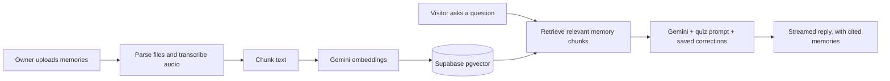

# MindClone

> A personal AI that talks like you, grounded in your own memories instead of generic answers.

**[Live demo](https://mindclone-tau.vercel.app)**


## What it does

MindClone lets anyone create an AI version of themselves. The owner answers a personality quiz, uploads their memories, and corrects the AI over time. Visitors then chat through a shareable link and feel like they're talking to the real person.

## Features

- **Personality quiz** that generates the AI's system prompt, which the owner can edit
- **Memory uploads**: `.txt`, `.pdf`, `.docx`, Twitter archives, and voice notes (transcribed with Gemini)
- **Public visitor chat** with streaming replies, a shareable link, and optional password protection
- **Private assistant** for the owner, with notes, tasks, and reminders alongside long-term memory
- **Corrections system**: the owner reviews transcripts, and saved corrections become permanent rules in future replies
- **Analytics dashboard**: visitor totals, message volume, topics, and which memories get used most
- **Owner settings**: display name, bio, greeting, photo, custom link, and visitor rules

## How it works



The RAG pipeline was written with help from OpenAI Codex.

## Tech stack

- **Frontend:** Next.js 14 (App Router), Tailwind CSS, shadcn-style UI components
- **Backend and data:** Supabase (auth, Postgres, pgvector, storage)
- **AI:** Gemini (chat, embeddings, voice transcription)
- **Deployment:** Vercel

## Getting started

```bash
npm install
cp .env.example .env.local   # then add your own Supabase and Gemini keys
npm run dev
```

Other useful commands: `npm run check:env`, `npm run lint`, `npm run typecheck`, `npm run release:check`.

For Supabase setup, see [`supabase/README.md`](supabase/README.md). For deployment, see [`docs/vercel-deployment.md`](docs/vercel-deployment.md).

## Project structure

```
app/          routes: auth, dashboard, chat
components/   UI components
lib/          Supabase clients and helpers
hooks/        React hooks
scripts/      env checks and deploy smoke tests
supabase/     migrations and setup docs
docs/         deployment guide
```

## Status

The full feature set above is built, and deployment scripts and a health-check endpoint are included. See [`docs/`](docs/) for the launch guide.
